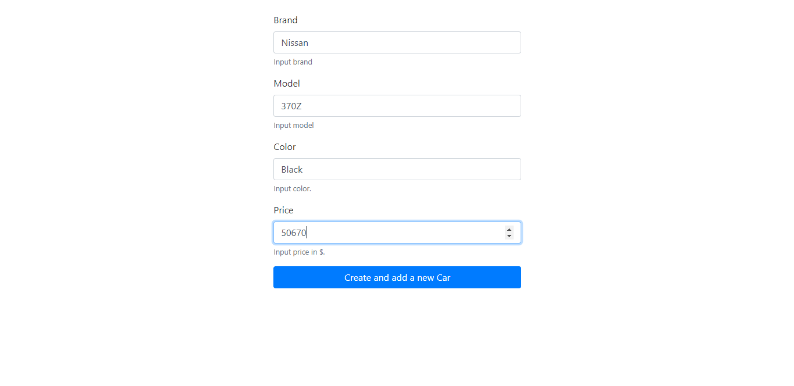

# httpCRUD - Task 2

The service contains a database of advertisements for the sale of cars and information about them (`ID`, `Brand`, `Model`, `Color`, `Price`).

**Adress:**  
`http://localhost:[port]/` (`GET`)  
`http://localhost:[port]/car` (`GET`, `POST`)  
`http://localhost:[port]/cars` (`GET`)  
`http://localhost:[port]/cars/{id:[0-9]+}` (`GET`)  
`http://localhost:[port]/cars/{id:[0-9]+}` (`PUT`)  
`http://localhost:[port]/cars/{id:[0-9]+}` (`DELETE`)

## How to start HTTP server:
### `Linux` / `Mac OS`:
**Simple commands:**    
`make help` - Show list commands.  
`make build` - Create `server.exe`.  
`make start` - Create and Run `server.exe`. (dependence `build`)  
`make clean` - Remove `server.exe`.  

**Docker:**  
`make docker` -  Build and Run image `server` (dependence `docker-build`, `docker-up`)  
`make docker-build` - Build image with name `server`.  
`make docker-up` - Start image `server`.  
`make docker-clean` - Clean image. Run two commands `docker system prune` and `docker rmi -f server`.  

---

## `/`  
Load page `add.html` that is in the folder `template`. After filling out the form and pressing the button, there will be a new `POST` request by address `/car`.  

---
## `/car` (GET, POST)

### Request `GET`:
Redirect to `http://localhost:[port]/`.  

### Request `POST`:
Retrieves data from forms or JSON and creates a new car sale ad.  

`FORM`:

  
#### **Response:**

In case of success  
```
(POST) SUCCESS! Added new car sale announcement.
```

`JSON`:

**Body:**
```json5
{
    "brand": "Mustang Shelby",
    "model": "GT500",
    "color": "Black",
    "price": 120000
}
```
**Endpoint:** `http://localhost:8081/car`

#### **Response:**
In case of success.

```
(JSON) SUCCESS! Added new car sale announcement.
```

---
### `/cars` (GET)  
Return in `JSON` format list cars. In my example:

**Endpoint:** `http://localhost:8081/cars`

#### Response:
```json5
[
    {
        "id": 1,
        "brand": "Mazda",
        "model": "CX-5",
        "color": "Aqua",
        "price": 25000
    },
    {
        "id": 2,
        "brand": "Aston Martin",
        "model": "One 77",
        "color": "Space Grey",
        "price": 80000.5
    }
]
```
---
### `/cars/{id:[0-9]+}` (GET)
Return in `JSON` format found car. In my example:  

**Endpoint:** `http://localhost:8081/cars/1`

#### Response:
```json5
{
    "id": 1,
    "brand": "Mazda",
    "model": "CX-5",
    "color": "Aqua",
    "price": 25000
}
```
---
### `/cars/{id:[0-9]+}` (PUT)
Updates the data of the car sale. In my Example: 

**Endpoint:** `localhost:8081/cars/1`  
**Body:** 
```json5
{
    "brand": "Subaru",
    "model": "Forester",
    "color": "Blue",
    "price": 45000.82
}
```  

#### Response:
In case of success:
```
(JSON) ID 1 UPDATED!
```

---
### `/cars/{id:[0-9]+}` (DELETE)
Removes ad by `ID`. In my Example:

**Endpoint:** `http://localhost:8081/cars/1`  

#### Response:
In case of success:
```
(JSON) SUCCESS! Deleted ID = 1
```
